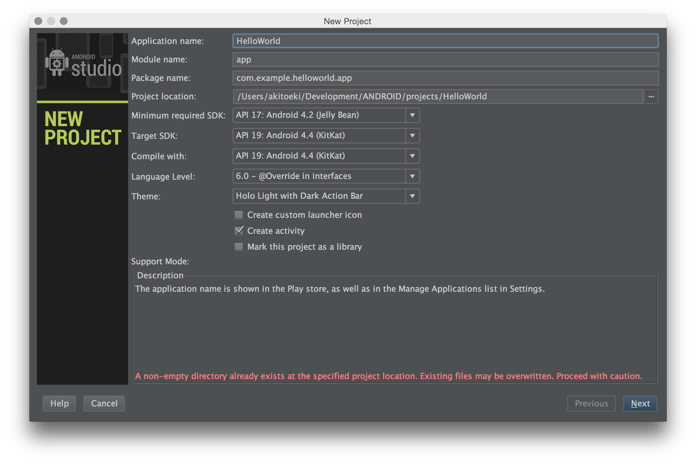
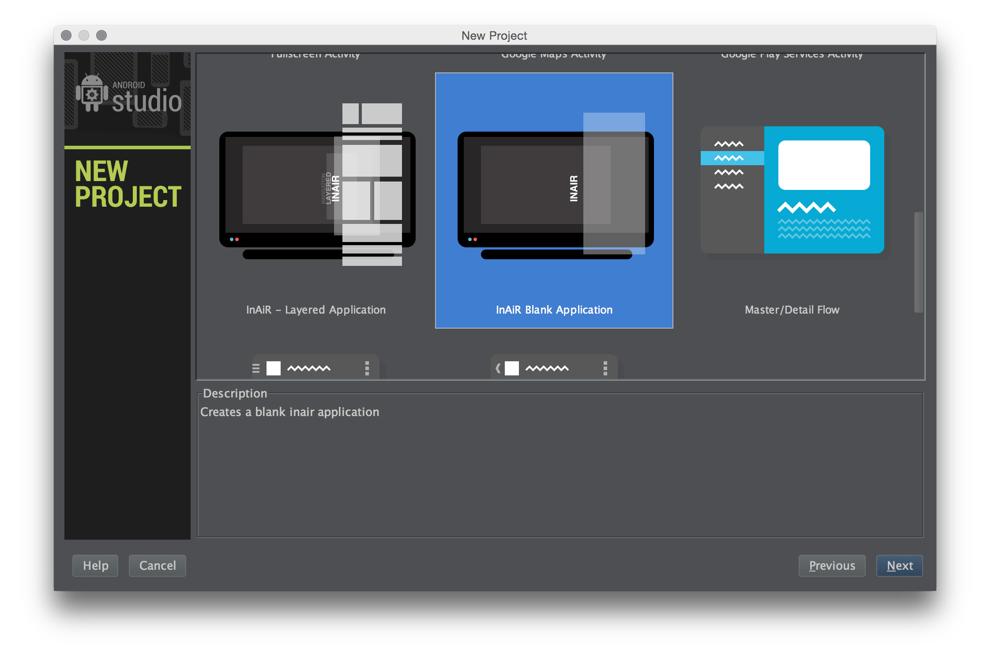
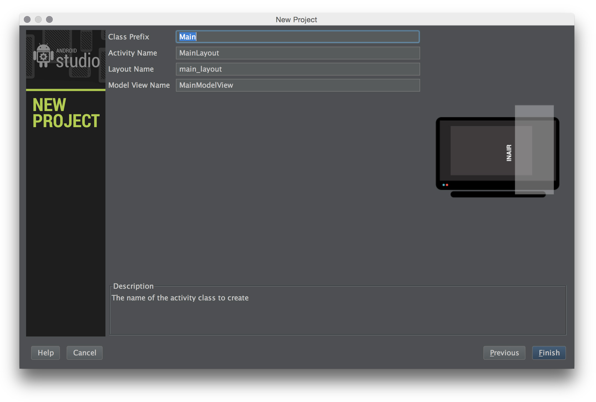

Creating an InAiR Project
=========================

An InAiR project contains all the files that comprise the source code for your InAiR app. The InAiR SDK tools make it easy to start a new InAiR project with a set of default project directories and files.

This lesson shows how to create a new project using Android Studio.

>**Note:** You should already have the Android SDK and Android Studio installed, if not follow the  Google's guide to [Installing the Android SDK](http://developer.android.com/sdk/installing/index.html) before you start this lesson.

Install InAiR App Template for Android Studio
---------------------------------------------
Although sharing lots of common libraries, InAiR Apps are quite different from a traditional Android Apps. Only Apps developed using our SDK will appear on our launcher. To make the process easier, we've provided two templates for you to quickly start your development.

####MacOSX
1. Download [InAiR App Templates](https://github.com/seespace/inair-app-templates/archive/master.zip)
2. Extract the .zip file
3. Locate your **Android Studio.app** application, right-click then choose *Show Package Content*
4. Navigate to `Android Studio.app/plugins/android/lib/templates/activities/`
5. Copy `InAirLayeredApp` and `InAirBlankApp` to the previous folder
6. Start (or Restart) Android Studio

####Windows & Linux
1. Download [InAiR App Templates](https://github.com/seespace/inair-app-templates/archive/master.zip)
2. Extract the .zip fle
4. Navigate to `<Your Android Studio Folder>/plugins/android/lib/templates/activities/`
5. Copy `InAirLayeredApp` and `InAirBlankApp` folders from the .zip file above
6. Start (or Restart) Android Studio

###Start a New Project
When you launch Android Studio for the first time, you'll see a Welcome screen that offers several ways to get started:

1. To start building a new app, click **New Project**.
This starts the New Project wizard, which helps you set up a project using an app template.

2. Fill the required fields:
  - **Application Name**  is the app name that appears to users. For this project, use "My First InAiR App."
  - **Module name:** Used by the IDE only, just leave it as default.
  - **Package Name** is the package namespace for your app (following the same rules as packages in the Java programming language). Your package name must be unique across all packages installed on the InAir system. For this reason, it's generally best if you use a name that begins with the reverse domain name of your organization or publisher entity.
  - **Minimum Required SDK, Target SDK, Compile with** are level of Android API to support. For InAir projects, please select **API 19: Android 4.4 (KitKat)** for all
  - **Language Level** Minimum supported is 6.0. You can choose 7.0 if you have JDK7 installed.
  - **Theme** InAiR App doesn't support this feature, you can leave it as it be, or choose None for consistency.
  - Make sure **Create activity** is the only enabled checkbox.
      Click **Next**
3. Browse and select **InAiR Blank App Template** and Click **Next**

4. On this screen, you are allowed to name your classes. For this demo, change the Class Prefix to "Test".

5. Leave all the other details as suggested by the template and click **Finish**.

Your InAir project is now a basic "Hello World" app that contains some default files. To run the app, continue to the next lesson.
>**Note:** For additional help using Android Studio, read [Tips and Tricks](http://developer.android.com/sdk/installing/studio-tips.html).
