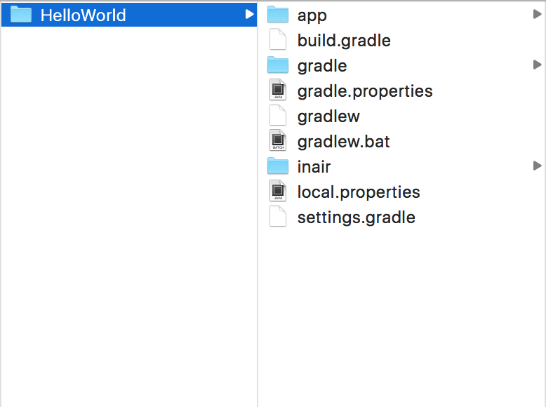

Creating an InAiR Project
=========================

An InAiR project contains all the files that comprise the source code for your InAiR app. The InAiR SDK tools make it easy to start a new InAiR project with a set of default project directories and files.

This tutorial shows how to create a new project using [InAiR App Generator](../../Airman.md) .

>**Note:** You should already have the Android SDK, Android Studio and InAiR App Generator installed. If you don't have these, follow the guide to [Installing the Android SDK](http://developer.android.com/sdk/installing/index.html) before you start this tutorial. 


Create a project with InAiR App Generator
-----------------------------------------
Although sharing lots of common libraries, InAiR Apps are quite different from a traditional Android Apps. Only Apps developed using our SDK will appear on our launcher. 

To make the process easier, we've provided [InAiR App Generator](../../Airman.md) for you to quickly start your development. If you haven't installed it yet, please follow instructions [here](../../Airman.md).

1. Launch Airman and choose a template (__BlankApp__ in this tutorial)

2. Select the output folder


3. Configure your app


4. Voila, your new app has been generated. Open `settings.gradle` in [Android Studio](http://developer.android.com/tools/studio/index.html) and start hacking!



Your InAir project is now a basic "Hello World" app that contains some default files. To run the app, continue to the next tutorial.

Create a Project with Command Line Tools
----------------------------------------
InAiR App Generator is the GUI for [Yeoman](http://yeoman.io). Yeoman helps you to kickstart new projects, prescribing best practices and tools to help you stay productive. Install Yeoman using this one-line command:

```
npm install -g yo
```

Then install InAiR generators:

```
npm install -g generator-inair-blankapp
npm install -g generator-inair-layeredapp
```

You're now have global `yo` command line tool and 2 generators: inair-blankapp & inair-layeredapp. To generate a new __BlankApp__, run:

```
yo inair-blankapp
```

Enter Application Name & Package Name and `yo` will generate a project for you.


