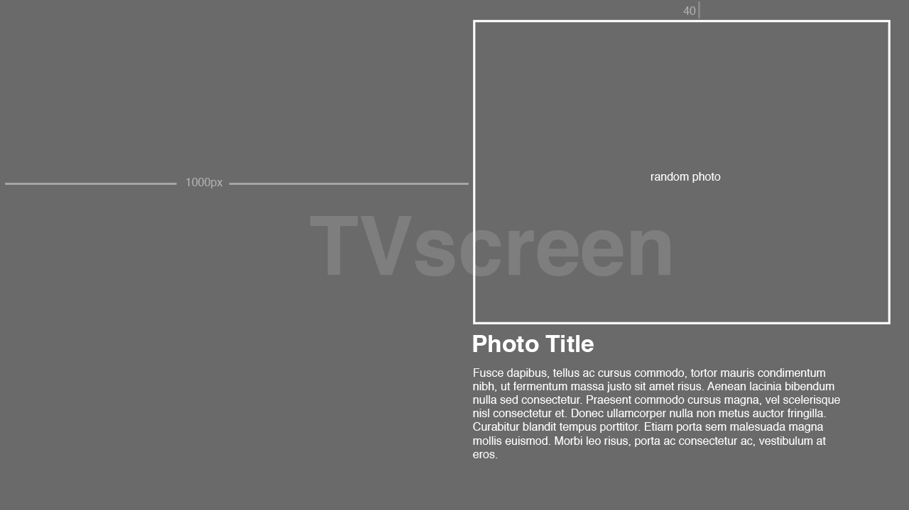
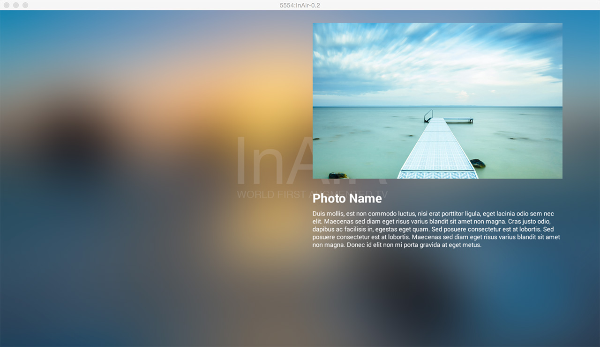

Build a Simple Slideshow
========================

Same as Android, InAiR app is built using a hierarchy of `UIView` and `UIViewGroup`. InAiR provides an XML vocabulary that corresponds to the subclasses of `UIView` and `UIViewGroup` so you can define your UI in XML using a hierarchy of UI elements.

Continue from where we left off, this Lesson will guide you through building a simple Photo Gallery App.


Let's assume we want to try something like the following design:




##Creating the Layout XML File

Open the `test_layout.xml` file fom `res/layout` directory.

The InAirBlankApp template we choosed at the begining of this tutorial includes a `test_layout.xml` file with a __UIViewGroup__ and a __UITextView__ child view.

First, removes the `<UITextView>` element from the xml file.

Back to the design, we notice that most of the contents are located to the right side of the TV screen, with a distance of 1000 pixel to the left side of the screen, and 40 pixel to the rest of the border, thus with some math calculation. we add some properties to the existing `UIViewGroup` so that can fit all the content we wanted as follow.

> **Notes:** The pixel resolution of the screen is always 1920x1080 (aka 1080p). There's no other resolution in InAir. For design guideline, please refer to [this document](#design_guideline)

```xml
<?xml version="1.0" encoding="utf-8"?>
<UIViewGroup
  xmlns:tools="http://schemas.android.com/tools"
  xmlns:ui="http://schemas.android.com/apk/res-auto"
  tools:context=".TestLayout"
  ui:width="840"
  ui:height="1000"
  ui:positionX="1000"
  ui:positionY="40"
  ui:positionZ="0"
>

</UIViewGroup>
```
The variable `ui:width`, `ui:height`, `ui:positionX` and `ui:positionY` are variables that define the boundings of the view group.

Look back at the initial wireframe, we also need an Image `UIImageView`, and 2 text labels (`UITextView`). Add them to the `UIViewGroup`:

```xml
<?xml version="1.0" encoding="utf-8"?>
<UIViewGroup
  xmlns:tools="http://schemas.android.com/tools"
  xmlns:ui="http://schemas.android.com/apk/res-auto"
  tools:context=".TestLayout"
  ui:width="840"
  ui:height="1000"
  ui:positionX="1000"
  ui:positionY="40">

  <UIImageView
    ui:width="800"
    ui:height="500"
    ui:src="@drawable/photo1"
  />

  <UITextView
    ui:height="60.0"
    ui:width="800.0"
    ui:text="Photo Name"
    ui:textColor="@color/white"
    ui:textSize="40.0"
    ui:textStyle="bold"
    ui:alpha="1.0"
    ui:positionX="0.0"
    ui:positionY="540.0"
    ui:positionZ="0.0"
  />

  <UITextView
    ui:height="400.0"
    ui:width="800.0"
    ui:text="Duis mollis, est non commodo luctus, nisi erat porttitor ligula, eget lacinia odio sem nec elit. Maecenas sed diam eget risus varius blandit sit amet non magna. Cras justo odio, dapibus ac facilisis in, egestas eget quam. Sed posuere consectetur est at lobortis. Sed posuere consectetur est at lobortis. Maecenas sed diam eget risus varius blandit sit amet non magna. Donec id elit non mi porta gravida at eget metus."
    ui:textColor="@color/white"
    ui:textSize="20.0"
    ui:textStyle="normal"
    ui:alpha="1.0"
    ui:positionX="0.0"
    ui:positionY="600.0"
    ui:positionZ="0.0"
  />
</UIViewGroup>
```

In order for the `UIImageView` to display an image, we need to have a photo named **photo1.jpg** in our **res/drawable** folder that matches the name in the property `ui:src="@drawable/photo1"`. Save the following pictures to your **res/drawable** folder: [photo1](../../images/photo1.jpg), [photo2](../../images/photo2.jpg), [photo3](../../images/photo3.jpg), [photo4](../../images/photo4.jpg), [photo5](../../images/photo5.jpg),

Now run your application again, you would get something like this.



Great, now you have the basic layout laid out. Proceed to the next lesson to learn how you can use *Binding* to make the Slideshow.