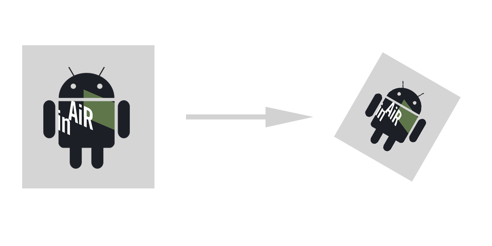

# Transform

## Overview

Before beginning our lesson, there're two concepts we need to learn about the coordinate spaces: __user space__, which represents the element's view, and __device space__, which represents the native resolution of a device. User space coordinates are floating-point numbers that are unrelated to the resolution of pixels in device space. When you want to print or display your UI element, Quartz maps user space coordinates to device space coordinates. Therefore, you never have to rewrite your application or write additional code to adjust the output from your application for optimum display on different devices.

You can modify the default user space by operating on the __current transformation matrix__, or CTM. After you create a graphics context, the CTM is the identity matrix. You can use [Android's Matrix](http://developer.android.com/reference/android/opengl/Matrix.html) functions to modify the CTM and, as a result, modify drawing in user space.

We provide an util class [Transform](#link) to make declaring the transform matrix easier.

##  Transformation Functions

You can easily translate, scale, and rotate your drawing using the InAiR's transform functions. With just a few lines of code, you can apply these transformations in any order and in any combination. The figure bellow illustrates the effects of scaling and rotating an image. Each transformation you apply updates the CTM. The CTM always represents the current mapping between user space and device space. This mapping ensures that the output from your application looks great on any display screen.

> 

## Sample Code
### Modifying the Current Transformation Matrix with Transform Util Class.

The following line of code initialize an image view then apply some simple transfomation to it:

```java
// Initialize the view
UIImageView imageView = new UIImageView(this);
imageView.setSource(getResources().getDrawable(R.drawable.ic_inairlogo));
imageView.setSize(200, 200);
imageView.setPosition(860, 440, 0);

// Remember to add the image to the root view
rootView.addView(imageView);

// Create a transform
float[] transform = Transform.fromIdentity()
  .translate(-300.0f, 0.0f, 0)
  .scale(0.5f, 0.5f, 1.0f)
  .rotate(90, 0.0f, 0.0f, 1.0f)
  .build();

//Set transform to the view
imageView.setTransform(transform);
```
The image will appear half in size, 300px to the left from its original position (center of the screen) and is rotated by 90 degrees clockwise.

If you want to return to the original object as defined in the layout file, then just setTransform to identity.

```java
image.setTransform(Transform.fromIdentity().build());
```

> **Note:** the translate function is affected by other previous transformation, e.g: if you scaled the object by 0.5, then translate the object 400px, then on the __device space__ (TV) is appeared to be translated only 200px; if you rotated the object previously, then translating the X-axis wouldn't always move horizontally.
