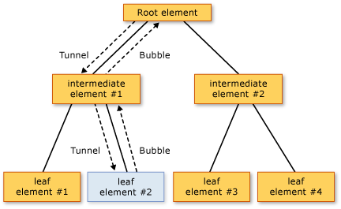

Input Event
===========

## Prerequisites
This topic elaborates on concepts introduced in the [Routed Event](#).

## Overview
One frequent application of routed events within the InAiR platform is for input events. In InAiR, tunneling routed events names are prefixed with the word "Preview" by convention. Input events often come in pairs, with one being the bubbling event and the other being the tunneling event. For example, the `TouchDown` event and the `PreviewTouchDown` event have the same signature, with the former being the bubbling input event and the latter being the tunneling input event. Occasionally, input events only have a bubbling version, or perhaps only a direct routed version. In the documentation, routed event topics cross-reference similar routed events with alternative routing strategies if such routed events exist, and sections in the managed reference pages clarify the routing strategy of each routed event.

InAiR input events that come in pairs are implemented so that a single user action from input, such as a swipe, will raise both routed events of the pair in sequence. First, the tunneling event is raised and travels its route. Then the bubbling event is raised and travels its route. The two events literally share the same event data instance, because the `raiseEvent` method call in the implementing class that raises the bubbling event listens for the event data from the tunneling event and reuses it in the new raised event. Listeners with handlers for the tunneling event have the first opportunity to mark the routed event handled (class handlers first, then instance handlers). If an element along the tunneling route marked the routed event as handled, the already-handled event data is sent on for the bubbling event, and typical handlers attached for the equivalent bubbling input events will not be invoked. To outward appearances it will be as if the handled bubbling event has not even been raised. This handling behavior is useful for control compositing, where you might want all focus-based input events to be reported by your final control, rather than its composite parts. The final control element is closer to the root in the compositing, and therefore has the opportunity to class handle the tunneling event first and perhaps to "replace" that routed event with a more control-specific event, as part of the code that backs the control class.

As an illustration of how input event processing works, consider the following input event example. In the following tree illustration, leaf element #2 is the source of both a `PreviewTouchDown` and then a `TouchDown` event.

Input Event Bubbling and Tunneling

The order of event processing is as follows:

1. **PreviewTouchDown** (tunnel) on root element.
2. **PreviewTouchDown** (tunnel) on intermediate element #1.
3. **PreviewTouchDown** (tunnel) on source element #2.
4. **TouchDown** (bubble) on source element #2.
5. **TouchDown** (bubble) on intermediate element #1.
6. **TouchDown** (bubble) on root element.

A routed event handler delegate provides references to two objects: the object that raised the event and the object where the handler was invoked. The object where the handler was invoked is the object reported by the sender parameter. The object where the event was first raised is reported by the `source` property in the event data. A routed event can still be raised and handled by the same object, in which case sender and `source` are identical (this is the case with Steps 3 and 4 in the event processing example list).

Because of tunneling and bubbling, parent elements receive input events where the `source` is one of their child elements. When it is important to know what the source element is, you can identify the source element by accessing the `source` property.

Usually, once the input event is marked `handled`, further handlers are not invoked. Typically, you should mark input events as handled as soon as a handler is invoked that addresses your application-specific logical handling of the meaning of the input event.

The shared event data model between tunneling and bubbling events, and the sequential raising of first tunneling then bubbling events, is not a concept that is generally true for all routed events. That behavior is specifically implemented by how InAir input devices choose to raise and connect the input event pairs. Implementing your own input events is an advanced scenario, but you might choose to follow that model for your own input events also.

Certain classes choose to class-handle certain input events, usually with the intent of redefining what a particular user-driven input event means within that control and raising a new event.

## "Preview" (Tunneling) Events vs. Bubbling Events
Preview routed events are events that follow a tunneling route through the element tree. The "Preview" expressed in the naming convention is indicative of the general principle for input events that preview (tunneling) routed events are raised prior to the equivalent bubbling routed event. Also, input routed events that have a tunneling and bubbling pair have a distinct handling logic. If the tunneling/preview routed event is marked as handled by an event listener, then the bubbling routed event will be marked handled even before any listeners of the bubbling routed event receive it. The tunneling and bubbling routed events are technically separate events, but they deliberately share the same instance of event data to enable this behavior.

The connection between the tunneling and bubbling routed events is accomplished by the internal implementation of how any given InAir class raises its own declared routed events, and this is true of the paired input routed events. But unless this class-level implementation exists, there is no connection between a tunneling routed event and a bubbling routed event that share the naming scheme: without such implementation they would be two entirely separate routed events and would not be raised in sequence or share event data.

## Preview Events and Input
When you handle Preview events in general, be cautious about marking the events handled in the event data. Handling a Preview event on any element other than the element that raised it (the element that is reported as the source in the event data) has the effect of not providing an element the opportunity to handle the event that it originated. Sometimes this is the desired result, particularly if the elements in question exist in relationships within the compositing of a control.

For input events specifically, Preview events also share event data instances with the equivalent bubbling event. If you use a Preview event class handler to mark the input event handled, the bubbling input event class handler will not be invoked. Or, if you use a Preview event instance handler to mark the event handled, handlers for the bubbling event will not typically be invoked.