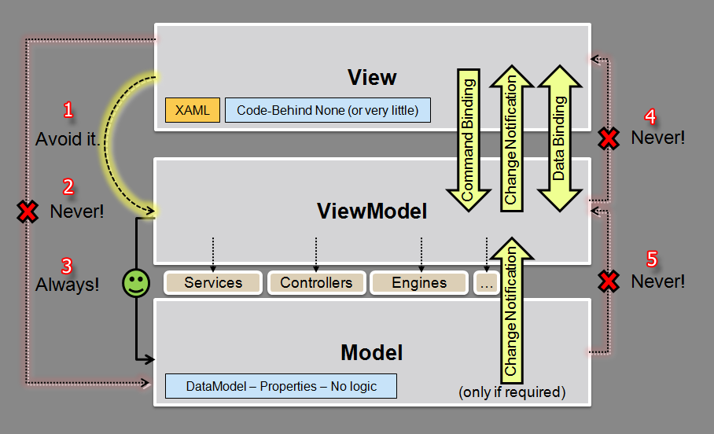

Layers & Architecture
===============

The next diagram shows the basic layers every MVVM implementation should have. It shows the allowed dependencies and the forbidden ones too:

----

**The following is the list of allowed and forbidden dependencies:**

1. The View's code behind should not reference the ViewModel. It is only allowed when calling DataContext's commands from View's events (but there are better ways of doing it without adding this dependency).
2. The View cannot reference anything from the Model. Neither code behind nor Bindings can talk with Model objects, only ViewModel ones.
3. The ViewModel should contain always a Model reference. It is completely forbiden that the Model knows anything from the ViewModel. That indicates a flawed design for sure.
4. The ViewModel must not know anything from the View as one ViewModel can work with different Views.