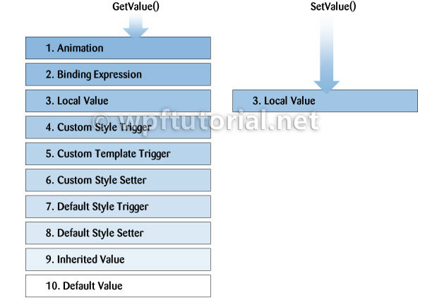

4.2. Value resolution strategy
===

Every time you access a dependency property, it internally resolves the value by following the precedence from high to low. It checks if a local value is available, if not if a custom style trigger is active,... and continues until it founds a value. At last the default value is always available.

