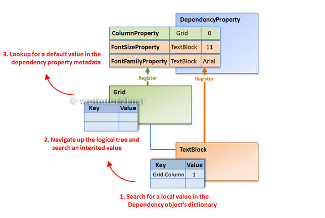

4.3. The magic behind it
===

Each WPF control registers a set of DependencyProperties to the static DependencyProperty class. Each of them consists of a key - that must be unique per type - and a metadata that contain callbacks and a default value.

All types that want to use DependencyProperties must derive from DependencyObject. This baseclass defines a key, value dictionary that contains local values of dependency properties. The key of an entry is the key defined with the dependency property.

When you access a dependency property over its .NET property wrapper, it internally calls GetValue(DependencyProperty) to access the value. This method resolves the value by using a value resolution strategy that is explained in detail below. If a local value is available, it reads it directly from the dictionary. If no value is set if goes up the logical tree and searches for an inherited value. If no value is found it takes the default value defined in the property metadata. This sequence is a bit simplified, but it shows the main concept.

