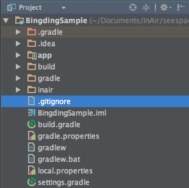

InAir Sample Project
===

We'll show you how to build an application with InAiR Framework with step by step. This app will show random sentences each 5 second. Color of the title will change if height of sentence more than 100 pixel. 

Let's Begin!

1. [Create a project with InAiR App Generator]()
3. [Binding data]()
 
Create a project with InAiR App Generator
---

Follow [InAiR App Generator](../Airman.md) to create blank project. And this is a structure of project after generate:



Build a Simple App
---

As you can see in [Getting started]() we showed you structure of the pject and Let's assume we want to try something like the following design.

Updating the Layout
---

The __BlankApp__ template we selected at the begining of this tutorial includes a `activity_main.xml` file with a __`UIViewGroup`__ and a __`UITextView`__ child view. 

Edit `activity_main.xml` as this: 

```xml
<?xml version="1.0" encoding="utf-8"?>
<UIViewGroup
  xmlns:ui="http://schemas.android.com/apk/res-auto"
  ui:id="@+id/viewGroup">

  <UITextView
    ui:height="200.0"
    ui:width="400.0"
    ui:text="{Binding Path='title'}"
    ui:textColor="@color/white"
    ui:fontSize="35"
    ui:alpha="1.0"
    ui:positionX="1280.0"
    ui:positionY="100.0"
    ui:positionZ="0.0"/>

  <UITextView
      ui:id="@+id/contentId"
      ui:height="200.0"
      ui:width="400.0"
      ui:text="{Binding Path='content'}"
      ui:textColor="@color/white"
      ui:fontSize="25"
      ui:alpha="1.0"
      ui:positionX="1280.0"
      ui:positionY="280.0"
      ui:positionZ="0.0"/>

</UIViewGroup>

```

As you can see, we have a `UIViewGroup` with id is viewGroup. Inside view group have two child text view `UITextView`. The first text view will show title and the second text view will show random sentences.

The View Model
---

1. In **Android Studio**, in the java directory, select the package, **tv.inair.sample.binding**, right-click, and select **New > Package**.
2. In the **Create New Package** window, set the package name is **viewmodel** and click OK
3. Select package **viewmodel**, right-click, create new java class and set name is `TextViewModel`.
3. Open the `TextViewModel.java` file.
4. To use InAiR `ViewModel` APIs, our class must extend InAiR abstract class `ViewModel`. Create the required constructor with only one argument `IAContext`.


Your class should read as follows:

```java
public class TextViewModel extends ViewModel {

  public TextViewModel(IAContext context) {
    super(context);
  }
  
}
```

In `activity_main.xml` file we have two properties that will be used to bind to our layout are `title` and `content`

```xml
<UITextView
    ui:height="200.0"
    ui:width="400.0"
    ui:text="{Binding Path='title'}"
    ui:textColor="@color/white"
    ui:fontSize="35"
    ui:alpha="1.0"
    ui:positionX="1280.0"
    ui:positionY="100.0"
    ui:positionZ="0.0"/>
```

and 

```xml
<UITextView
      ui:id="@+id/contentId"
      ui:height="200.0"
      ui:width="400.0"
      ui:text="{Binding Path='content'}"
      ui:textColor="@color/white"
      ui:fontSize="25"
      ui:alpha="1.0"
      ui:positionX="1280.0"
      ui:positionY="280.0"
      ui:positionZ="0.0"/>
```

So in class `TextViewModel` we have to define two properties `title` and `content` like this

```java
 private CharSequence title;

  public CharSequence getTitle() {
    return title;
  }

  public void setTitle(CharSequence title) {
    this.title = title;
    notifyPropertyChanged("title");
  }

  private CharSequence content;

  public CharSequence getContent() {
    return content;
  }

  public void setContent(CharSequence content) {
    this.content = content;
    notifyPropertyChanged("content");
  }
```

Notice the function `notifyPropertyChanged("<property's name>")`. This function will tell the system that the corresponding property has changed and the layout should refresh to update with the new value. 

> Remember that `{Binding Path='<property's name>'}` and `notifyPropertyChanged("<property's name>")` have to same string. 

The Activity
---


