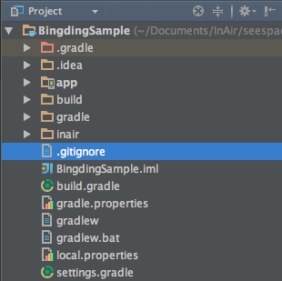

InAir Sample Project
===

We'll show you how to build an application with InAiR Framework with step by step. This app will show random sentences each 5 second. Color of the title will change if height of sentence more than 100 pixel. 

Let's Begin!

1. [Create a project with InAiR App Generator](README.md)
3. [Binding data](../../1-getting-started/1-build-your-first-app/4-binding-data.md)
 
Create a project with InAiR App Generator
---

Follow [InAiR App Generator](../Airman.md) to create blank project. And this is a structure of project after generate:



Build a Simple App
---

As you can see in [Getting started]() we showed you structure of the pject and Let's assume we want to try something like the following design.

Updating the Layout
---

The __BlankApp__ template we selected at the begining of this tutorial includes a `activity_main.xml` file with a __`UIViewGroup`__ and a __`UITextView`__ child view. 

Edit `activity_main.xml` as this: 

```xml
<?xml version="1.0" encoding="utf-8"?>
<UIViewGroup
  xmlns:ui="http://schemas.android.com/apk/res-auto"
  ui:id="@+id/viewGroup">

  <UITextView
    ui:height="200.0"
    ui:width="400.0"
    ui:text="{Binding Path='title'}"
    ui:textColor="@color/white"
    ui:fontSize="35"
    ui:alpha="1.0"
    ui:positionX="1280.0"
    ui:positionY="100.0"
    ui:positionZ="0.0"/>

  <UITextView
      ui:id="@+id/contentId"
      ui:height="200.0"
      ui:width="400.0"
      ui:text="{Binding Path='content'}"
      ui:textColor="@color/white"
      ui:fontSize="25"
      ui:alpha="1.0"
      ui:positionX="1280.0"
      ui:positionY="280.0"
      ui:positionZ="0.0"/>

</UIViewGroup>

```

As you can see, we have a `UIViewGroup` with id is viewGroup. Inside view group have two child text view `UITextView`. The first text view will show title and the second text view will show random sentences.

The View Model
---

1. In **Android Studio**, in the java directory, select the package, **tv.inair.sample.binding**, right-click, and select **New > Package**.
2. In the **Create New Package** window, set the package name is **viewmodel** and click OK
3. Select package **viewmodel**, right-click, create new java class and set name is `TextViewModel`.
3. Open the `TextViewModel.java` file.
4. To use InAiR `ViewModel` APIs, our class must extend InAiR abstract class `ViewModel`. Create the required constructor with only one argument `IAContext`.


Your class should read as follows:

```java
public class TextViewModel extends ViewModel {

  public TextViewModel(IAContext context) {
    super(context);
  }
  
}
```

In `activity_main.xml` file we have two properties that will be used to bind to our layout are `title` and `content`

```xml
<UITextView
    ui:height="200.0"
    ui:width="400.0"
    ui:text="{Binding Path='title'}"
    ui:textColor="@color/white"
    ui:fontSize="35"
    ui:alpha="1.0"
    ui:positionX="1280.0"
    ui:positionY="100.0"
    ui:positionZ="0.0"/>
```

and 

```xml
<UITextView
      ui:id="@+id/contentId"
      ui:height="200.0"
      ui:width="400.0"
      ui:text="{Binding Path='content'}"
      ui:textColor="@color/white"
      ui:fontSize="25"
      ui:alpha="1.0"
      ui:positionX="1280.0"
      ui:positionY="280.0"
      ui:positionZ="0.0"/>
```

So in class `TextViewModel` we have to define two properties `title` and `content` like this

```java
 private CharSequence title;

  public CharSequence getTitle() {
    return title;
  }

  public void setTitle(CharSequence title) {
    this.title = title;
    notifyPropertyChanged("title");
  }

  private CharSequence content;

  public CharSequence getContent() {
    return content;
  }

  public void setContent(CharSequence content) {
    this.content = content;
    notifyPropertyChanged("content");
  }
```

Notice the function `notifyPropertyChanged("<property's name>")`. This function will tell the system that the corresponding property has changed and the layout should refresh to update with the new value. 

> Remember that `{Binding Path='<property's name>'}` and `notifyPropertyChanged("<property's name>")` have to same string. 

The Activity
---

In the class 'TextViewModel' edit like this:

```java
...
public class TextViewModel extends ViewModel {
    ...
    public static final String TITLE = "These are possibly the 5 best sentences you’ll ever read and all applicable to this experiment:";
    public static final String[] STRING_ARRAY = {
      "1. You cannot legislate the poor into prosperity by legislating the wealthy out of prosperity.",
      "2. What one person receives without working for, another person must work for without receiving.",
      "3. The government cannot give to anybody anything that the government does not first take from somebody else.",
      "4. You cannot multiply wealth by dividing it!",
      "5. When half of the people get the idea that they do not have to work because the other half is going to take care of them, and when the other half gets the idea that it does no good to work because somebody else is going to get what they work for, that is the beginning of the end of any nation."
  };
    ...
}
```

In the class `MainActivity` edit like this

```java
public class MainActivity extends IAActivity {

  public static final String TAG = "Binding Sample";
  private TextViewModel textViewModel;

  @Override
  public void onInitialize(Bundle bundle) {
    textViewModel = new TextViewModel(this);
    setAndBindRootContentView(R.layout.activity_main, textViewModel);
    
    textViewModel.setTitle(TextViewModel.TITLE);
    randomText();
  }
}
```

Function `setAndBindRootContentView(idView, viewModel)` will set root view to for this activity and set view will bind to viewModel. 

View will show random 5 sentences every 5 second in variable array `ARRAY_STRING` in class `TextViewModel`, so we wrote a method in class `MainActivity` to do that:

```java
private void randomText() {
    final Handler handler = new Handler();
    Timer timer = new Timer();
    TimerTask task = new TimerTask() {
      @Override
      public void run() {
        handler.post(new Runnable() {
          @Override
          public void run() {
            int randInt = randomInt(0, TextViewModel.STRING_ARRAY.length - 1);
            String content = TextViewModel.STRING_ARRAY[randInt];
            textViewModel.setContent(content);
          }
        });
      }
    };

    timer.schedule(task, 0, 5000);
  }

  private int randomInt(int min, int max) {
    Random rand = new Random();
    return rand.nextInt((max - min) + 1) + min;
  }
```

Every each 5 second we got a sentence and show in view with method `textViewModel.setContent(content)`. This will trigger changes property and refresh view with a new data. 

Now run your application, and the text will change automatic each 5 second.

If you don't want to use xml layout you can use programmatic to build the view and binding. Edit class `MainActivity` like this:

```java
@Override
  public void onInitialize(Bundle bundle) {
    textViewModel = new TextViewModel(this);

    uiViewGroup = new UIViewGroup(this);
    uiTextTitleView = new UITextView(this);
    uiTextContentView = new UITextView(this);

    uiTextTitleView.setHeight(200.0f);
    uiTextTitleView.setWidth(400.0f);
    uiTextTitleView.setFontSize(30.0f);
    uiTextTitleView.setPosition(1280, 100, 0);

    Binding titleBinding = new Binding("title");
    titleBinding.setSource(textViewModel);
    uiTextTitleView.setBinding(UITextView.TextProperty, titleBinding);

    uiTextContentView.setHeight(200.0f);
    uiTextContentView.setWidth(400.0f);
    uiTextContentView.setFontSize(20.0f);
    uiTextContentView.setPosition(1280, 250, 0);

    Binding contentBinding = new Binding("content");
    contentBinding.setSource(textViewModel);
    uiTextContentView.setBinding(UITextView.TextProperty, contentBinding);

    uiViewGroup.addView(uiTextTitleView);
    uiViewGroup.addView(uiTextContentView);

    textViewModel.setTitle(TextViewModel.TITLE);
    setRootContentView(uiViewGroup);

    randomText();
  }
```

Now run your application again, and the text will change automatic each 5 second.

Advance Binding
---

Because the second `UITextView` will change automatic every 5 second so height this view is dynamic. Now if you want change text color of the title when height of the view content more than 100 pixel we'll use **Converter**.

We have to bind height of the second text view to textColor in first text view because height change and textColor change too.

1. In **Android Studio**, in the java directory, select the package, **tv.inair.sample.binding**, right-click, and select **New > Package**.
2. In the **Create New Package** window, set the package name is **converter** and click OK.
3. Select package **converter**, right-click, create new java class and set name is `TextColorConverter`.
3. Open the `TextColorConverter.java` file.
4. Class `TextColorConverter` must implements interface `IValueConverter` and override two method as below:

```java
public class TextColorConverter implements IValueConverter {
  public static final TextColorConverter INSTANCE = new TextColorConverter();

  @Override
  public Object convert(Object value, Class<?> targetType) {
    if (((float) value) > 100) {
      return Color.CYAN;
    }

    return Color.BLUE;
  }

  @Override
  public Object convertBack(Object value, Class<?> targetType) {
    return null;
  }
}

```

We have to way to use class `TextColorConverter` <br />

**1. Use with xml.**

Edit xml file as below:

```xml
<UITextView
    ui:height="200.0"
    ui:width="400.0"
    ui:text="{Binding Path='title'}"
    ui:textColor="{Binding Path='height', Source='contentId', Converter='tv.inair.sample.binding.converter.TextColorConverter' }"
    ui:fontSize="35"
    ui:alpha="1.0"
    ui:positionX="1280.0"
    ui:positionY="100.0"
    ui:positionZ="0.0"/>

  <UITextView
      ui:id="@+id/contentId"
      ui:height="200.0"
      ui:width="400.0"
      ui:text="{Binding Path='content'}"
      ui:textColor="@color/white"
      ui:fontSize="25"
      ui:alpha="1.0"
      ui:positionX="1280.0"
      ui:positionY="280.0"
      ui:positionZ="0.0"/>

```

Now run your application again and see the result.

**2. Use with programmatic.**

Exit class `MainActivity` like this:

```java
@Override
  public void onInitialize(Bundle bundle) {
    ...
    uiTextTitleView.setBinding(UITextView.TextProperty, titleBinding);

    Binding colorBinding = new Binding(uiTextContentView, UITextView.HeightProperty, TextColorConverter.INSTANCE);
    uiTextTitleView.setBinding(UITextView.TextColorProperty, colorBinding);

    uiTextContentView.setHeight(200.0f);
    ...
}
```

Now run your application again and see the result.


