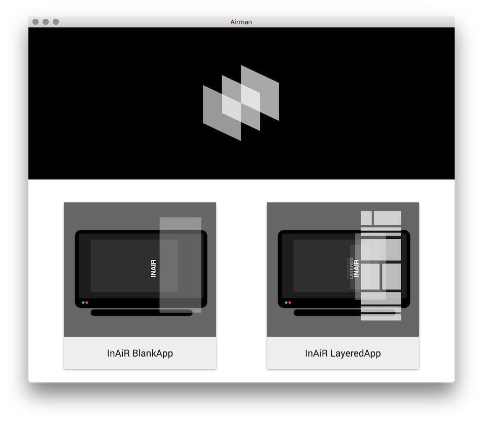
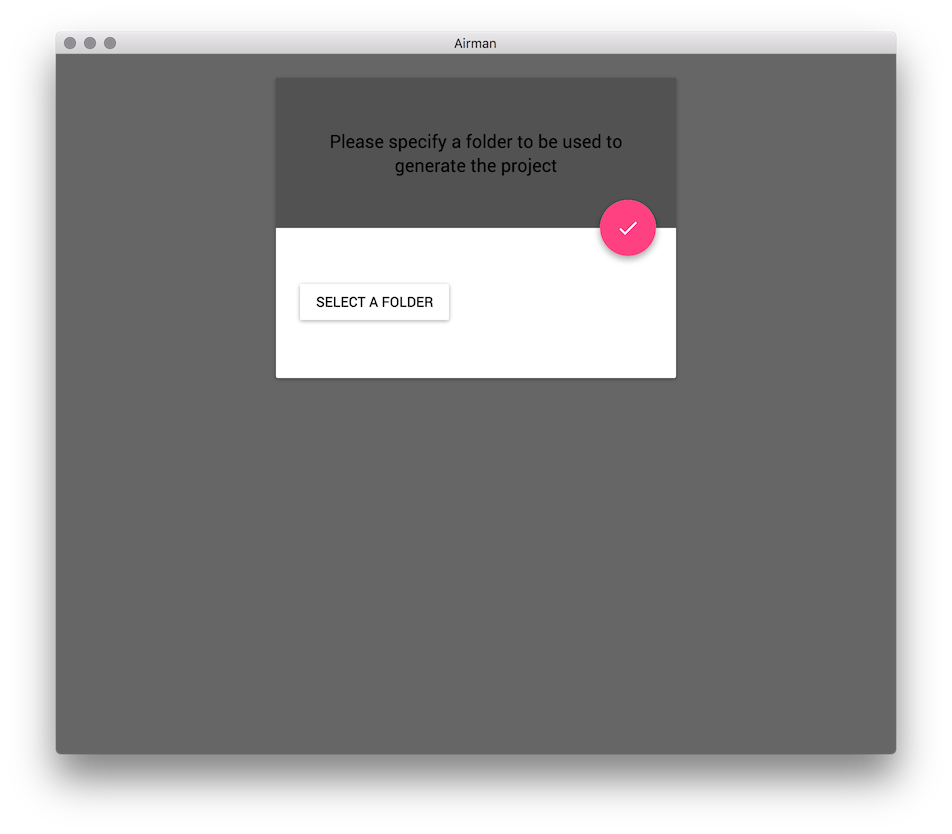
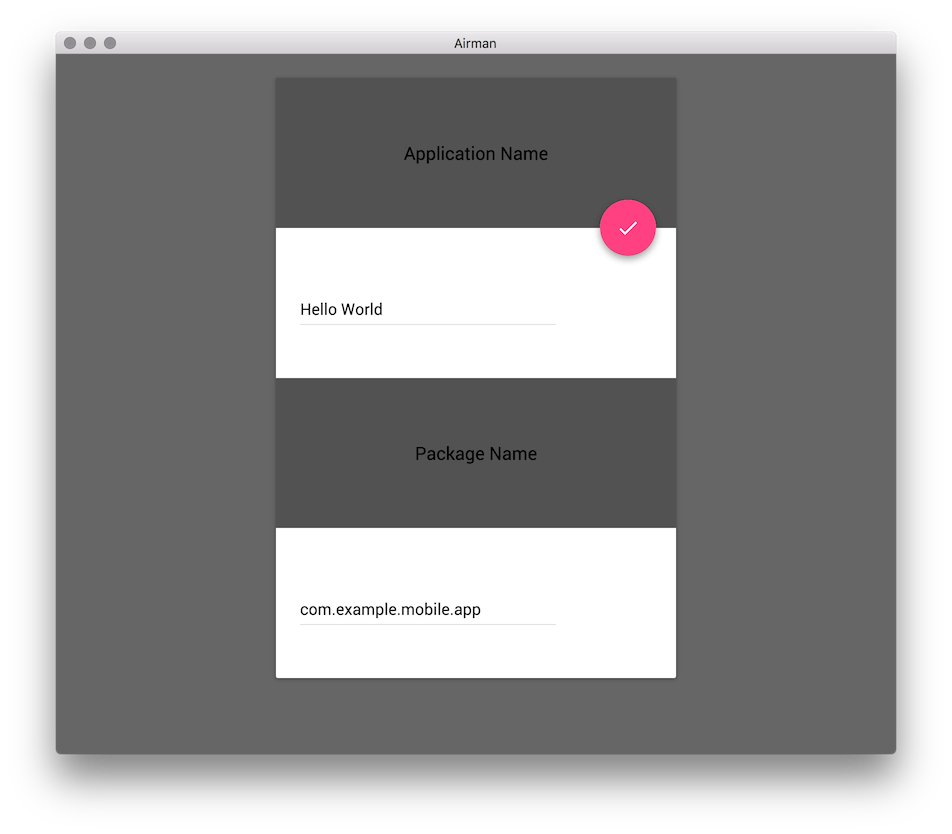
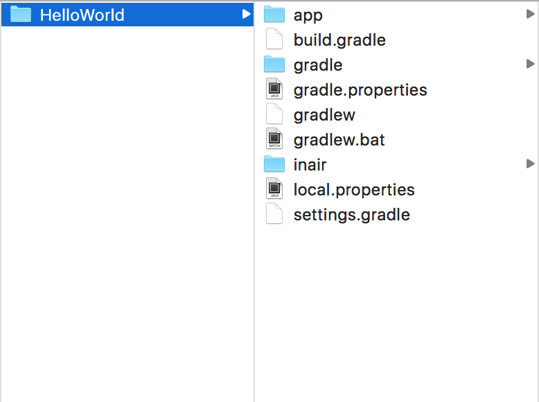

InAiR App Generator  
===================

Airman is a desktop app that scaffolds InAiR projects using Yeoman. 

Download
--------

* [OS X](https://download.inair.tv/airman/airman-osx-v0.1.2.zip)
* [Window x64]()
* [Window x86]()

Usages
------

1. Launch Airman and choose a template (__BlankApp__ or __LayeredApp__)

2. Select the output folder

3. Configure your app

4. Voila, your new app has been generated. Open `settings.gradle` in [Android Studio](http://developer.android.com/tools/studio/index.html) and start hacking!

Help and Support
----------------

You can ask a question or signal an issue in the [GitHub](https://github.com/longseespace/yeoman-app/issues) issue page.

